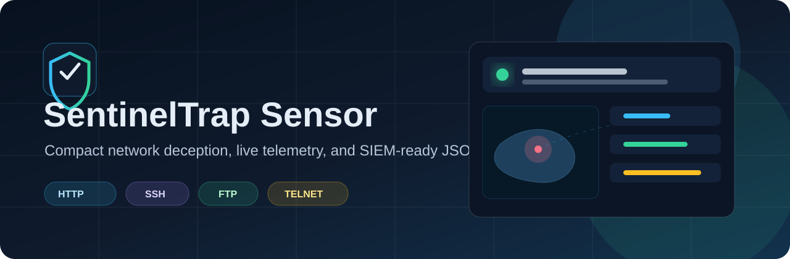
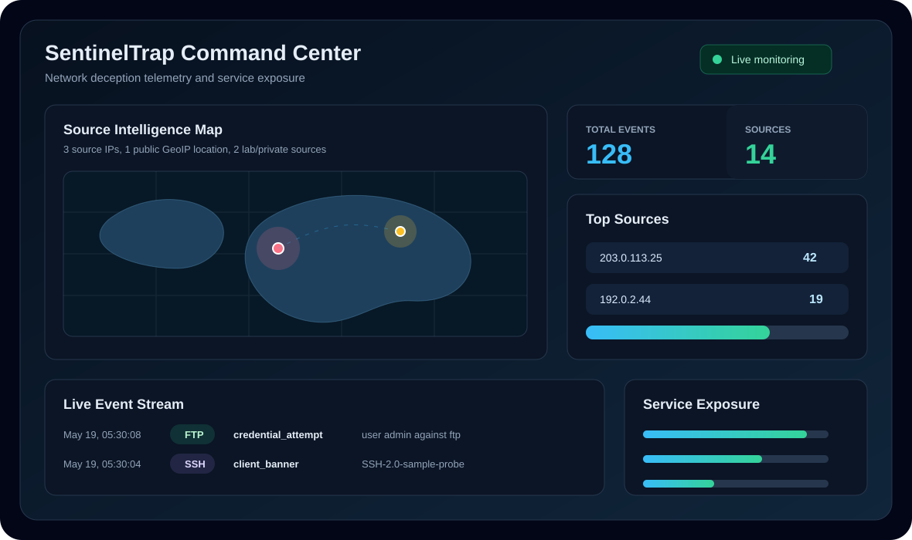
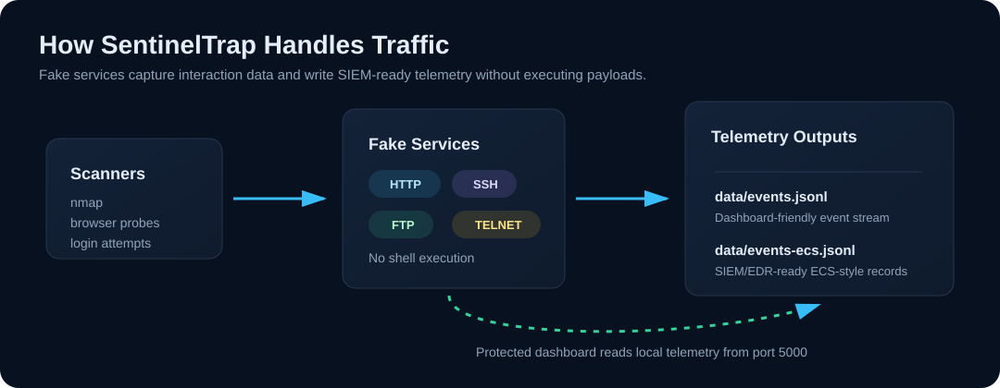

# SentinelTrap Sensor



[](https://www.python.org/)
[](#run)
[](#logs-for-siem-or-edr)
[](#dashboard)

SentinelTrap Sensor is a compact network deception sensor for controlled lab and
internal security demonstrations. It exposes believable fake HTTP, SSH, FTP, and
Telnet services, captures interaction attempts, enriches source metadata, and
writes telemetry that can be viewed in a protected dashboard or forwarded into
SIEM/EDR workflows.

## About

SentinelTrap is designed to make honeypot and deception concepts easy to show
without deploying a heavy platform. It behaves like a lightweight sensor: fake
services listen on configurable ports, every connection or login attempt is
recorded, and the dashboard presents activity through source mapping, event
streams, service exposure metrics, and top source summaries.

The sensor does not execute submitted commands or exploit payloads. It captures
what reaches the fake services and stores the evidence locally for analysis.

## Visual Preview



## Architecture



## Highlights

- Fake HTTP, SSH, FTP, and Telnet services on separate ports.
- Protected dashboard on port `5000` with username/password login.
- Professional fake HTTP portal: `NexusEdge Gateway`.
- Live source map, event stream, top source cards, and service exposure bars.
- Local JSONL event storage under `data/`.
- ECS-style JSONL output for SIEM/EDR ingestion.
- Optional public GeoIP enrichment with local caching.
- Sanitized sample logs included under `samples/`.
- No external Python runtime dependencies.

## Dashboard

The dashboard is served from `dashboard.html` and is protected by a login page.
If you do not provide a dashboard password, SentinelTrap generates one at startup
and prints it in the terminal.

Default dashboard:

```text
http://127.0.0.1:5000/
```

LAN dashboard example:

```text
http://YOUR-LAN-IP:5000/
```

## Run

Local-only mode:

```powershell
python .\sentineltrap_sensor.py
```

LAN mode:

```powershell
python .\sentineltrap_sensor.py --bind 0.0.0.0
```

LAN mode with fixed dashboard credentials:

```powershell
python .\sentineltrap_sensor.py --bind 0.0.0.0 --dashboard-user operator --dashboard-password "ChangeThisInLab"
```

Environment variable credentials:

```powershell
$env:SENTINELTRAP_DASHBOARD_USER="operator"
$env:SENTINELTRAP_DASHBOARD_PASSWORD="ChangeThisInLab"
python .\sentineltrap_sensor.py --bind 0.0.0.0
```

## Default Ports

| Service | Port | Purpose |
| --- | ---: | --- |
| HTTP | 8080 | Fake gateway portal and web probe capture |
| SSH | 2222 | Banner grabbing and connection logging |
| FTP | 2121 | Command logging and fake credential capture |
| Telnet | 2323 | Legacy plaintext login capture |
| Dashboard | 5000 | Protected monitoring interface |

Change ports:

```powershell
python .\sentineltrap_sensor.py --http-port 8081 --ssh-port 2022 --dashboard-port 5050
```

## Logs for SIEM or EDR

Real telemetry is stored locally under `data/`. This directory is ignored by git
because it can contain internal IP addresses, user agents, and submitted
credentials from scans or login attempts.

| File | Purpose |
| --- | --- |
| `data/events.jsonl` | Dashboard-friendly event log |
| `data/events-ecs.jsonl` | ECS-style JSON Lines for SIEM/EDR pipelines |
| `samples/sample-events.jsonl` | Sanitized sample UI log for repository viewers |
| `samples/sample-events-ecs.jsonl` | Sanitized sample ECS log for repository viewers |

ECS-style records include fields such as:

- `@timestamp`
- `event.action`
- `event.dataset`
- `source.ip`
- `source.port`
- `destination.ip`
- `destination.port`
- `network.protocol`
- `service.name`
- `observer.type`
- `sentineltrap.detail`

## Demo Commands

HTTP page visit:

```powershell
curl.exe http://127.0.0.1:8080/
```

HTTP credential attempt:

```powershell
curl.exe -X POST http://127.0.0.1:8080/login -d "username=admin&password=password123"
```

Suspicious web path:

```powershell
curl.exe http://127.0.0.1:8080/.env
```

Scan the fake HTTP and SSH ports:

```powershell
nmap -sV -p 8080,2222 127.0.0.1
```

Windows connection checks:

```powershell
Test-NetConnection 127.0.0.1 -Port 2222
Test-NetConnection 127.0.0.1 -Port 2121
Test-NetConnection 127.0.0.1 -Port 2323
```

If you have `nc` or `ncat` installed:

```powershell
ncat 127.0.0.1 2121
ncat 127.0.0.1 2323
```

## GeoIP

Localhost and private lab-network traffic is shown as lab traffic on the map.
Real geographic locations require public source IPs and GeoIP enrichment.

Enable public GeoIP lookup:

```powershell
python .\sentineltrap_sensor.py --geo-lookup
```

Public IP lookups use `ipwho.is` and are cached in `data/geo-cache.json`.

## Safety Notes

- Keep public internet exposure out of scope for simple demos.
- Use a controlled lab network and get permission from the network owner.
- Run exposed demos inside a VM, container, or disposable lab host.
- Firewall the sensor away from production devices.
- Treat captured credentials as sensitive, even when they are fake examples.
- The fake services do not execute submitted payloads, but the host is still
  reachable on the network.

## Repository About

Suggested GitHub repository description:

```text
Compact network deception sensor with fake HTTP/SSH/FTP/Telnet services, protected dashboard, source map, and SIEM-ready JSONL telemetry.
```

Suggested topics:

```text
honeypot, deception, cybersecurity, siem, ecs, threat-intelligence, network-security, python, blue-team
```
